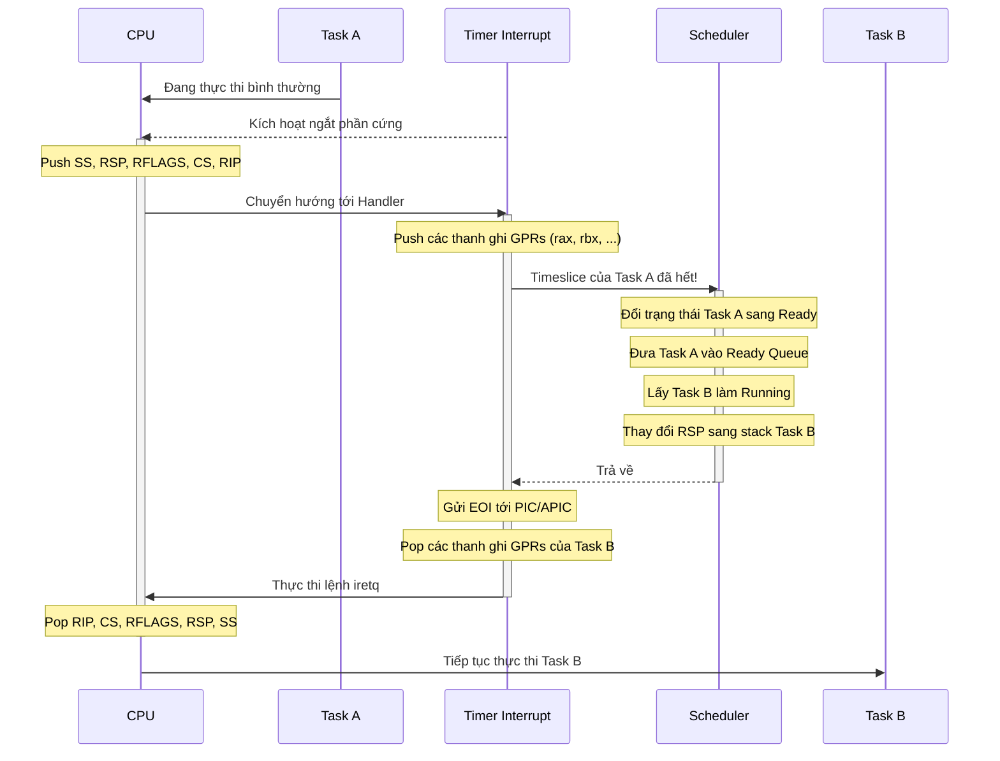

# Spec: 014-preemptive-scheduler-design (Đặc tả thiết kế trình lập lịch trưng dụng)

- **Feature ID**: 014-preemptive-scheduler-design
- **Tiêu đề**: Đặc tả thiết kế trình lập lịch trưng dụng (Preemptive Scheduler)
- **Trạng thái**: COMPLETE
- **Người phụ trách**: Kỹ sư trưởng AxiomOS
- **Ngày tạo**: 2026-07-07
- **Ngày cập nhật**: 2026-07-07

---

## 1. Vấn đề cần giải quyết
Trình lập lịch cộng tác (Cooperative Scheduler) hiện tại yêu cầu mỗi task phải tự động gọi `yield_now()` để nhường quyền điều khiển. Nếu một task gặp lỗi vòng lặp vô hạn, hoặc tính toán nặng mà không yield, toàn bộ hệ thống (bao gồm cả nhân kernel) sẽ bị đóng băng.

Hệ điều hành desktop hiện đại yêu cầu cơ chế lập lịch trưng dụng (Preemptive Scheduling) để đảm bảo:
1. **Sự phản hồi (Responsiveness)**: Hệ thống luôn phản hồi kịp thời với các sự kiện người dùng (bàn phím, chuột).
2. **Sự cô lập lỗi (Fault Isolation)**: Một task bị treo không thể làm sập hoặc treo toàn bộ hệ thống.
3. **Độ công bằng (Fairness)**: Phân chia thời gian CPU công bằng giữa các task.

## 2. Mục tiêu
- Thiết kế giải pháp kỹ thuật tích hợp ngắt phần cứng (Hardware Timer Interrupt) để tự động ngắt (preempt) task đang chạy.
- Định nghĩa cấu trúc lưu trữ ngữ cảnh ngắt (Interrupt Context / Stack Frame) và luồng hoán đổi stack an toàn khi xảy ra ngắt.
- Xác định cơ chế tính toán timeslice (quantum) cho mỗi tiến trình.
- Thiết kế API lập lịch trưng dụng tương thích ngược với API scheduler cộng tác hiện tại.

## 3. Không thuộc phạm vi
- Hiện thực code lập lịch trưng dụng cho Milestone 4 (Milestone này chỉ hoàn thành đặc tả thiết kế).
- Thiết kế lập lịch đa nhân (Symmetric Multiprocessing - SMP).
- Thuật toán lập lịch phức tạp (ví dụ: Multi-level Feedback Queue - MLFQ). Chỉ sử dụng Round-Robin với ngắt Timer.

## 4. Thiết kế Kiến trúc & Interfaces

### 4.1. Luồng ngắt Timer và Trưng dụng (Preemption Flow)
Khi ngắt Timer xảy ra (được tạo ra bởi PIT hoặc APIC Timer định kỳ):
1. CPU tự động push các thanh ghi trạng thái tối thiểu lên stack (`SS`, `RSP`, `RFLAGS`, `CS`, `RIP`).
2. Trình xử lý ngắt (Interrupt Handler) được IDT kích hoạt.
3. Interrupt Handler lưu trữ các thanh ghi đa dụng còn lại (General Purpose Registers - GPRs) lên stack hiện tại của task đang chạy để tạo thành một `InterruptStackFrame` hoàn chỉnh.
4. Trình xử lý ngắt tăng bộ đếm ticks và kiểm tra xem timeslice của task hiện tại đã hết chưa.
5. Nếu timeslice đã hết:
   - Gọi hàm lập lịch `schedule_from_interrupt()`.
   - Trình lập lịch lấy task tiếp theo từ `ready_queue`.
   - Cập nhật con trỏ stack của task cũ và trỏ `RSP` sang stack của task mới.
6. Gửi tín hiệu End-of-Interrupt (EOI) cho PIC/APIC.
7. Khôi phục các thanh ghi đa dụng từ stack của task mới.
8. Thực thi lệnh `iretq` để trở về không gian thực thi của task mới.



### 4.2. Cấu trúc dữ liệu thiết kế

#### A. Cấu trúc Ngữ cảnh Stack ngắt (Interrupt Stack Frame)
```rust
#[repr(C, packed)]
pub struct InterruptStackFrame {
    // Các thanh ghi được lưu thủ công bởi handler
    pub r15: u64,
    pub r14: u64,
    pub r13: u64,
    pub r12: u64,
    pub r11: u64,
    pub r10: u64,
    pub r9: u64,
    pub r8: u64,
    pub rdi: u64,
    pub rsi: u64,
    pub rbp: u64,
    pub rdx: u64,
    pub rcx: u64,
    pub rbx: u64,
    pub rax: u64,
    
    // Các thanh ghi được CPU tự động push khi xảy ra ngắt
    pub rip: u64,
    pub cs: u64,
    pub rflags: u64,
    pub rsp: u64,
    pub ss: u64,
}
```

#### B. Mở rộng Task Control Block (TCB)
```rust
pub struct Task {
    pub id: u32,
    pub stack: Box<[u8]>,
    pub stack_ptr: u64, // RSP trỏ tới đỉnh InterruptStackFrame khi task bị treo
    pub state: TaskState,
    pub ticks_left: u32, // Số tick (ms) còn lại trong timeslice hiện tại (ví dụ: mặc định 10ms)
}
```

### 4.3. Interface APIs dự kiến
```rust
/// Trình xử lý ngắt Timer (được đăng ký trong IDT)
#[no_mangle]
pub unsafe extern "x86-interrupt" fn timer_interrupt_handler(
    frame: &mut InterruptPageFrame
) {
    // 1. Tăng thời gian hệ thống và cập nhật ticks_left của task hiện tại.
    // 2. Nếu ticks_left == 0, gọi scheduler để thực hiện preempt.
}

/// Thực hiện chuyển đổi ngữ cảnh từ bên trong ngắt.
/// Nhận con trỏ trỏ tới RSP được lưu của task cũ và RSP của task mới.
pub unsafe fn switch_context_in_interrupt(
    old_rsp_ptr: *mut u64,
    new_rsp: u64
);
```

## 5. Ràng buộc thiết kế & Xử lý lỗi
- **Cấm cấp phát trong interrupt handler**: Trình lập lịch không được phép gọi các hàm cấp phát bộ nhớ động (`alloc`, `Box`, `Vec`) trong quá trình xử lý ngắt vì có thể gây deadlock hoặc làm chậm trễ ISR.
- **Tránh race condition**: Scheduler state và queue phải được bảo vệ bằng `SpinlockIrqSave` để tránh việc một ngắt Timer lồng nhau sửa đổi hàng đợi khi trình lập lịch đang chạy.
- **Thời gian xử lý ngắt cực ngắn**: Logic tính toán timeslice phải tối giản để tránh gây jitter hoặc làm trễ các ngắt quan trọng khác.

## 6. Kế hoạch Test (Acceptance Criteria)

### Kịch bản 1: Trưng dụng tự động
- **Given**: AxiomOS chạy với hai task nhân chạy vòng lặp vô hạn `loop {}` không hề gọi `yield_now()`.
- **When**: Ngắt Timer kích hoạt sau mỗi 10ms.
- **Then**: Hệ thống phải tự động hoán đổi luồng thực thi giữa hai task này một cách tuần hoàn mà không bị đóng băng CPU.
